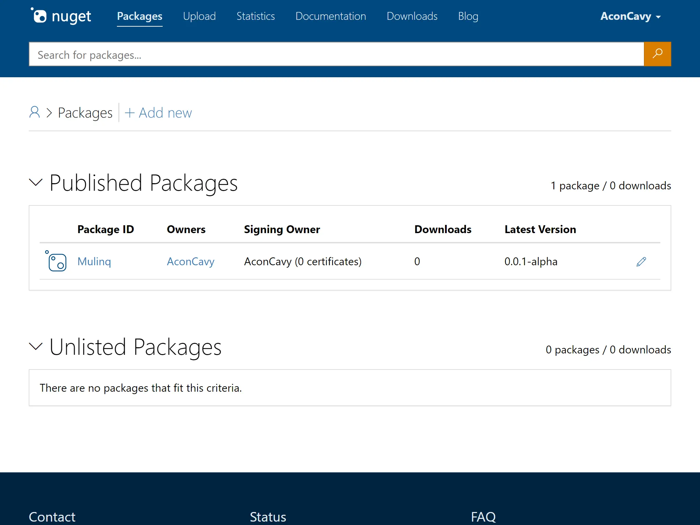
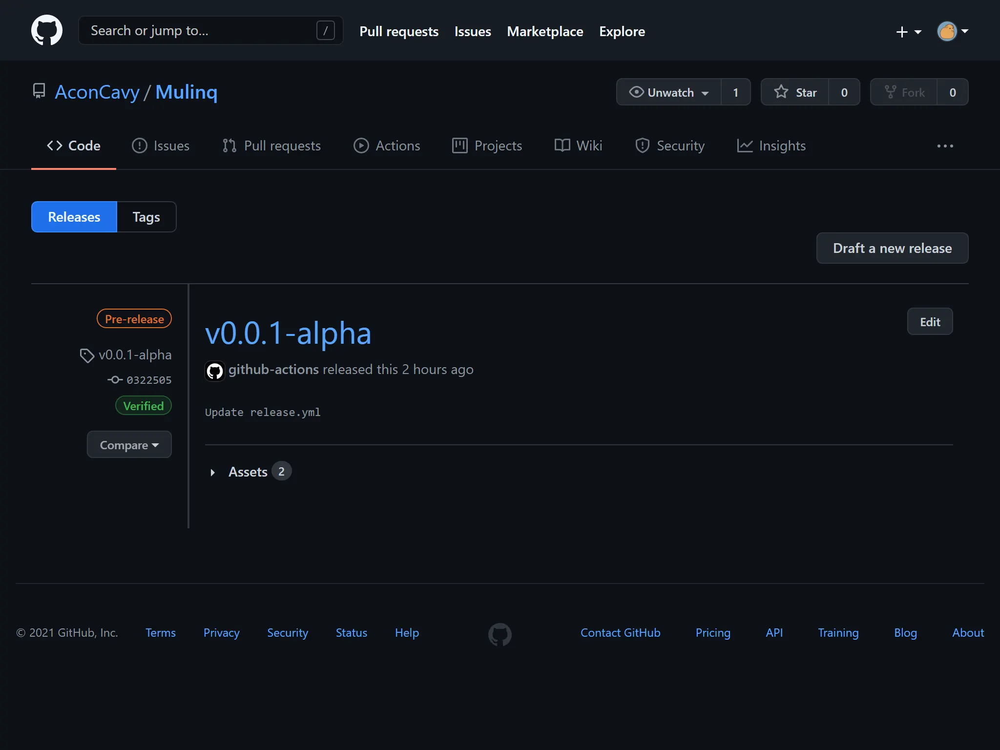

Title: GitHub ActionsからNuGetにパッケージをアップロードした
Published: 01/21/2021
Updated: 01/21/2021
Tags: [.NET, GitHub Actions, NuGet] 

--

# はじめに

GitHub Actionsで.NETプロジェクトからNuGetパッケージの作成、Releaseの作成およびNuGetにパッケージをアップロードするまでをまとめた記事です。

リポジトリは[こちら](https://github.com/AconCavy/Mulinq)

## TL;DR

- GitHub ActionsでNuGetパッケージを作成した。
- 作成したNuGetパッケージをNuGetにアップロードした。
- タグからリリース/プレリリースを判断できるようにした。

# 対象の.NETプロジェクトの設定

パッケージ化する.NETプロジェクトの`.csproj`ファイルを更新します。
今回はビルド構成として.NET 5と.NET Core 3.1のdllを生成するために、`TargetFrameworks`に`net5.0`と`netcoreapp3.1`を構成します。

そして、NuGetの情報を構成します。今回は`.csproj`に構成しましたが、`.nuspec`ファイルを作成してNuGet情報だけを切り離して構成することも可能なようです。
`PackageVersion`はcsprojをリリースのたびに変更せずに、ビルド時にバージョンを指定できるように、`$(Version)`の環境変数を使います。

```xml
<Project Sdk="Microsoft.NET.Sdk">

    <PropertyGroup>
        <TargetFrameworks>net5.0;netcoreapp3.1</TargetFrameworks>
    </PropertyGroup>
    
    <!-- NuGet -->
    <PropertyGroup>
        <PackageId>Mulinq</PackageId>
        <PackageVersion>$(Version)</PackageVersion>
        <Title>Mulinq</Title>
        <Authors>AconCavy</Authors>
        <Description>Mulinq is C# LINQ extensions for collections and for multidimensional arrays.</Description>
        <PackageProjectUrl>https://github.com/AconCavy/Mulinq</PackageProjectUrl>
        <PackageLicenseExpression>MIT</PackageLicenseExpression>
        <RepositoryUrl>https://github.com/AconCavy/Mulinq</RepositoryUrl>
        <PackageTags>LINQ</PackageTags>
    </PropertyGroup>

</Project>
```

# NuGetの設定

NuGetアカウントを持っていない場合はアカウントの作成をします。Microsoftアカウントから作成もできるみたいです。

NuGetパッケージのアップロードには、NuGetのAPIキーが必要なので、APIキーを生成します。
画面右上のユーザから、`API Keys`のページに移動し、`Create`フォームから、`Key Name`や`Package Owner`等必要な情報を埋め、APIキーを生成します。
生成に成功すると、`Manage`パネルに生成したAPIキーが並ぶので、`Copy`でAPIキーをコピーします。一度ページから離れてしまうと、再びコピーできなくなるので、できなくなった場合は`Regenerate`から再生成します。

コピーしたAPIキーをGitHubリポジトリの`Secrets`に登録することで、GitHub Actionsの環境変数としてアクセスできるようになります。リポジトリの`Setting -> Secrets -> New repository secret`で新しいシークレットを作成し、名前とAPIキーを登録します。今回は`NUGET_API_KEY`として登録しました。

# Workflowの作成

[リポジトリを作成したときにやっておきたいこと](20201212createrepository)のReleaseの作成をもとにWorkflowを作成します。

RelaseのWorkflowを実行するトリガーとして、`v1.0.0`や`v1.0.0-alpha`のようなGitのタグがpushされたときに限定します。

```yml
on:
  push:
    tags: 
    - 'v[0-9]+.[0-9]+.[0-9]+*'
```

最初にテストを実行します。今回はTargetFrameworkが複数あるため、複数の.NET SDKをセットアップします。

```yml
jobs:
  test:
    runs-on: ubuntu-latest
    steps:
    - uses: actions/checkout@v2
    - name: Setup .NET 3.1.x
      uses: actions/setup-dotnet@v1
      with:
        dotnet-version: 3.1.x
    - name: Setup .NET 5.0.x
      uses: actions/setup-dotnet@v1
      with:
        dotnet-version: 5.0.x
    - name: Test
      run: dotnet test -c Release --verbosity normal
```

次にテストが成功した場合のみリリースを実行します。`needs: [test]`とすることで、`test`のjobが成功した場合のみ実行されるようになります。
まず、プロジェクトからNuGetパッケージを作成します。このとき、`-p:Version`にバージョンを指定します。タグのバージョン情報を取得するために、`${GITHUB_REF##*/v}`を指定します。

```
dotnet pack ./src/Mulinq/Mulinq.csproj -c Release -p:Version=${GITHUB_REF##*/v} -o ./publish
```

`GITHUB_REF`の環境変数では、ワークフローをトリガーしたタグのrefを取得でき、`v1.0.0`のようなタグの場合は`refs/heads/v1.0.0`という文字列を取得できます。そこから`1.0.0`の部分だけ取得し、`Version`の環境変数に指定します。
ビルドに成功した場合は、`./publish`に`Mulinq.1.0.0.nupkg`が生成されます。

そして、NuGetのAPIを叩き、作成した`.nupkg`をアップロードします。`secrets.NUGET_API_KEY`から、リポジトリに登録したNuGetのAPIキーを参照します。`secrets.<*>`は上記で登録したシークレットの名前になります。

```yml
release:
    runs-on: ubuntu-latest
    needs: [test]
    steps:
    - uses: actions/checkout@v2
    - name: Setup .NET Core 3.1.x
      uses: actions/setup-dotnet@v1
      with:
        dotnet-version: 3.1.x
    - name: Setup .NET 5.0.x
      uses: actions/setup-dotnet@v1
      with:
        dotnet-version: 5.0.x
    - name: Build
      run: dotnet pack ./src/Mulinq/Mulinq.csproj -c Release -p:Version=${GITHUB_REF##*/v} -o ./publish
    - name: Upload to NuGet
      run: dotnet nuget push ./publish/*.nupkg -k ${{ secrets.NUGET_API_KEY }} -s https://api.nuget.org/v3/index.json
    
    - name: Create Release
      id: create_release
      uses: actions/create-release@v1
      env:
        GITHUB_TOKEN: ${{ secrets.GITHUB_TOKEN }}
      with:
        tag_name: ${{ github.ref }}
        release_name: ${{ github.ref }}
        draft: false
        prerelease: ${{ contains(github.ref, '-') }}
```

また、GitHubにReleaseを作成します。
`prerelease`のプロパティに`true|false`を指定することで、作成するリリースがプレリリースか否かを指定できます。そのため、タグに`-`が含まれているかをチェックする`contains`関数を使用して、`v1.0.0`のような普通のリリースの場合と、`v1.0.0-alpha`のようなプレリリースを区別できるようにしました。

```yml
- name: Create Release
  id: create_release
  uses: actions/create-release@v1
  env:
    GITHUB_TOKEN: ${{ secrets.GITHUB_TOKEN }}
  with:
    tag_name: ${{ github.ref }}
    release_name: ${{ github.ref }}
    draft: false
    prerelease: ${{ contains(github.ref, '-') }}
```


Workflow全体としては次のようになります。

```yml
name: Release

on:
  push:
    tags: 
    - 'v[0-9]+.[0-9]+.[0-9]+*'

jobs:
  test:
    runs-on: ubuntu-latest
    steps:
    - uses: actions/checkout@v2
    - name: Setup .NET 3.1.x
      uses: actions/setup-dotnet@v1
      with:
        dotnet-version: 3.1.x
    - name: Setup .NET 5.0.x
      uses: actions/setup-dotnet@v1
      with:
        dotnet-version: 5.0.x
    - name: Test
      run: dotnet test -c Release --verbosity normal
  
  release:
    runs-on: ubuntu-latest
    needs: [test]
    steps:
    - uses: actions/checkout@v2
    - name: Setup .NET Core 3.1.x
      uses: actions/setup-dotnet@v1
      with:
        dotnet-version: 3.1.x
    - name: Setup .NET 5.0.x
      uses: actions/setup-dotnet@v1
      with:
        dotnet-version: 5.0.x
    - name: Build
      run: dotnet pack ./src/Mulinq/Mulinq.csproj -c Release -p:Version=${GITHUB_REF##*/v} -o ./publish
    - name: Upload to NuGet
      run: dotnet nuget push ./publish/*.nupkg -k ${{ secrets.NUGET_API_KEY }} -s https://api.nuget.org/v3/index.json
    
    - name: Create Release
      id: create_release
      uses: actions/create-release@v1
      env:
        GITHUB_TOKEN: ${{ secrets.GITHUB_TOKEN }}
      with:
        tag_name: ${{ github.ref }}
        release_name: ${{ github.ref }}
        draft: false
        prerelease: ${{ contains(github.ref, '-') }}
```

# Workflowの実行

適当にコミットを作成し、`v0.0.1-alpha`というタグをつけ、GitHub上にプッシュします。

作成したWorkflowが実行され、テスト、ビルド、アップロード、Releaseの作成が行われます。

NuGetへアップロード直後は`Unlisted Packages`の状態でしたが、しばらくすると`Published Packages`になりました。



GitHubのリリースのほうは、ちゃんと`Pre-Release`で作成されています。


# まとめ

- GitHub ActionsでNuGetパッケージを作成した。
- 作成したNuGetパッケージをNuGetにアップロードした。
- タグからリリース/プレリリースを判断できるようにした。

NuGetのパッケージ作成は怖くない！